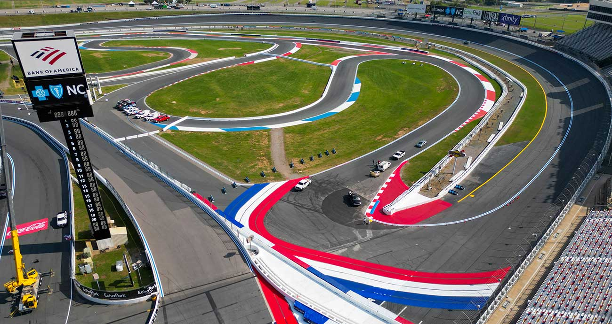
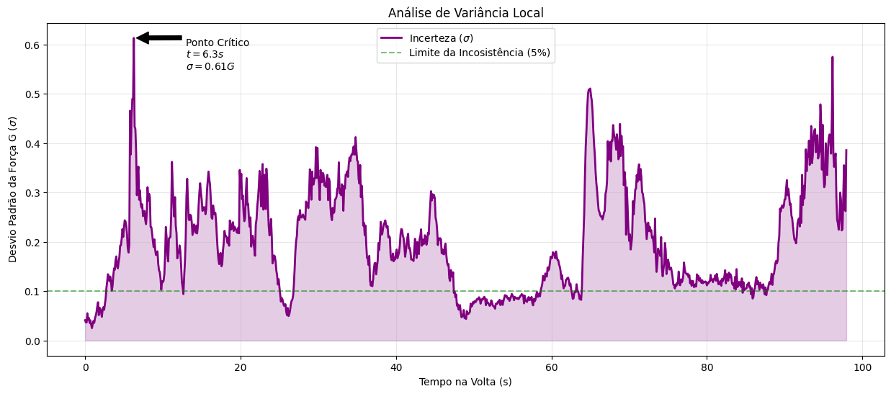
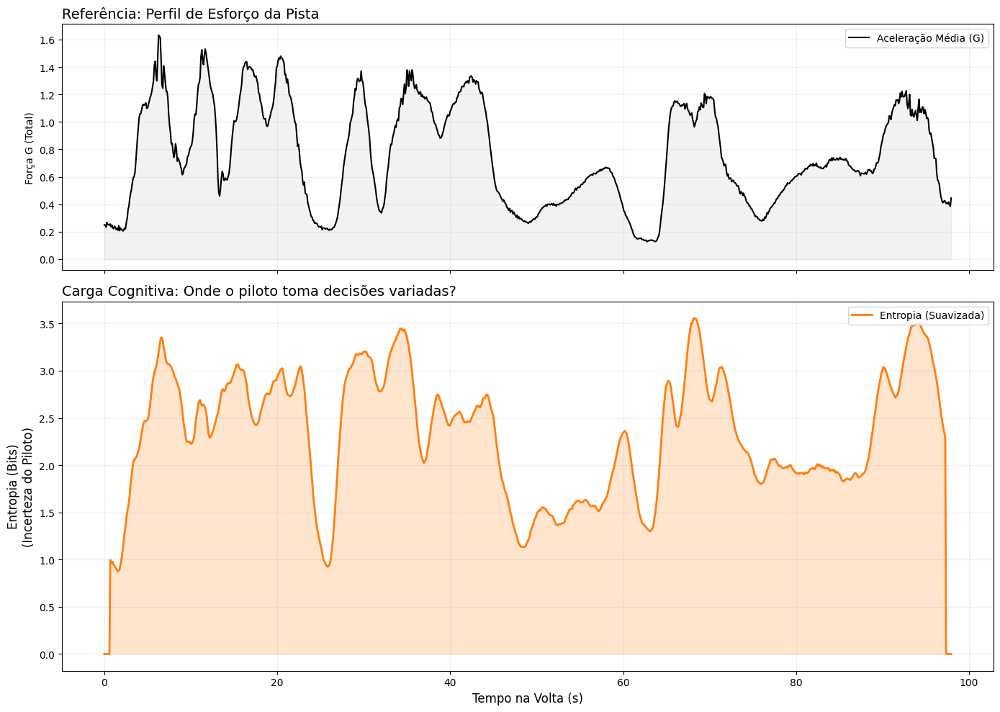
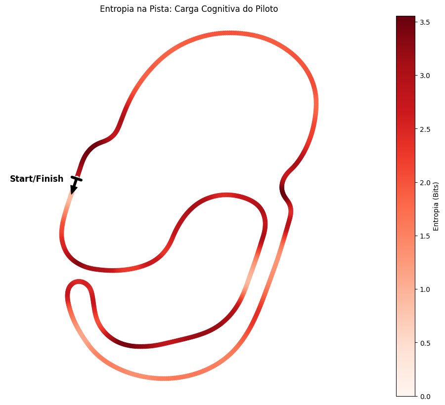

# Stochastic Analysis of Sim Racing Telemetry: A Probabilistic Approach to Driver Consistency


## 🏎️ Overview
This repository contains the source code and analysis for a study on **human performance in high-fidelity racing simulations**. Conducted as part of the **Probabilistic Systems** doctoral course at **UFRN (Federal University of Rio Grande do Norte)**, this project models a sim racer not as a deterministic agent, but as a **Stochastic Process**.

By analyzing 80 consecutive laps in **iRacing**, we investigate whether an expert pilot behaves as a **Wide-Sense Stationary (WSS)** system and how **Information Theory (Shannon Entropy)** can quantify cognitive load on the track.

## 🛠️ Installation & Configuration

To replicate this analysis, you need **Python 3.8+**. It is recommended to use a virtual environment to isolate dependencies.

### 1. Setup Environment
Run the following commands in your terminal:

```bash
# Clone the repository
git clone [https://github.com/TomazFilgueira/UFRN--PPGEEC2317-SISTEMAS-PROBABILISTICOS.git](https://github.com/TomazFilgueira/UFRN--PPGEEC2317-SISTEMAS-PROBABILISTICOS.git)
cd stochastic-sim-racing

# Create a virtual environment (Optional but recommended)
python -m venv venv
source venv/bin/activate  # On Windows use: venv\Scripts\activate

# Install required libraries
pip install -r requirements.txt
```

## 🧪 The Experiment
To ensure data quality and replicability, the experiment transformed the simulator into a controlled data laboratory:

* **Simulator:** iRacing (60Hz Telemetry).
* **Car:** Mazda MX-5 Global Cup (High sensitivity to mass transfer).
* **Track:** Charlotte Motor Speedway Roval (Mixed oval/infield layout).
* **Sample Size:** 80 consecutive valid laps ($N=80$) to allow for long-term stationarity tests.

<p align="center">
  
   
</p>
<p align="center">
  <em>Figure 1: Experimental Setup. Left: The Mazda MX-5 Global Cup car. Right: Aerial view of the Charlotte Roval circuit.</em>
</p>

## ⚙️ Methodology

### 1. Feature Engineering
Instead of analyzing lateral and longitudinal forces separately, we computed the **Combined Acceleration Magnitude ($G_{total}$)** to represent the usage of the tire's friction circle:

$$X(t) = \sqrt{G_{lat}(t)^2 + G_{long}(t)^2}$$

This scalar variable represents the total physical demand on the vehicle at any instant $t$.

### 2. Statistical Validation
We applied rigorous tests to validate the pilot's consistency:
* **Stationarity:** Augmented Dickey-Fuller (**ADF**) and **KPSS** tests to check for Unit Roots and Trend Stationarity.
* **Ergodicity:** Analysis of Autocorrelation Functions (ACF) to verify the Slutsky Condition (decaying memory).

### 3. Information Theory
We discretized the continuous acceleration signal into bins and calculated the **Shannon Entropy** to measure driver unpredictability (Cognitive Load):

$$H(X) = - \sum p(x_i) \log_2 p(x_i)$$

High entropy indicates high decision complexity, while low entropy indicates deterministic behavior.

---

## 📊 Key Results & Insights

### 1. The Pilot is a Stationary Process
Despite the deterministic trend of fuel consumption (which lightens the car and improves lap times), the **variance** of the pilot's input remained stable. The ADF and KPSS tests converged, confirming that the pilot operates as a **Wide-Sense Stationary (WSS)** controller.

### 2. The Dissociation of Physics and Cognition (The "Mastery" Insight)
We discovered that the moment of **maximum physical instability** (highest G-force variance at $t=6.3s$) **did not** coincide with the moment of **maximum entropy**.
* **Interpretation:** Even when the car is physically unstable (oscillating at the limit of grip), the expert pilot maintains cognitive control. The inputs are reactive but not random.


*Detail of maximum variance point*


*Plot of entropy*

### 3. Entropy Mapping
By projecting entropy values onto the track coordinates, we created a "Cognitive Heatmap". Red zones (High Entropy) perfectly align with braking zones and corner apexes, while straights remain low entropy.


*Figure: Spatial mapping of Shannon Entropy. Darker red indicates higher cognitive load/uncertainty.*

### 4. Ergodicity and Learning
The Autocorrelation Function (ACF) revealed a dual nature of driving:
* **Performance (Mean G):** Has "long memory" (slow decay), reflecting the cumulative learning curve.
* **Error (Std Dev):** Has "short memory" (rapid decay), proving the system is ergodic regarding errors. The pilot corrects mistakes instantly, preventing them from propagating to subsequent laps.

---

## 📂 Project Structure

```bash
├── data/
│   ├── raw/                 # Original .ibt telemetry files
│   └── processed/           # Cleaned CSVs (80 laps)
├── notebooks/
│   ├── 01_Exploratory_Data_Analysis.ipynb
│   ├── 02_Stationarity_Tests.ipynb
│   └── 03_Entropy_and_Ergodicity.ipynb
├── images/                  # Generated plots (KDE, Maps, ACF)
├── src/
│   ├── loader.py            # iRacing telemetry parser
│   └── math_tools.py        # Entropy and Statistical functions
├── README.md
└── requirements.txt
